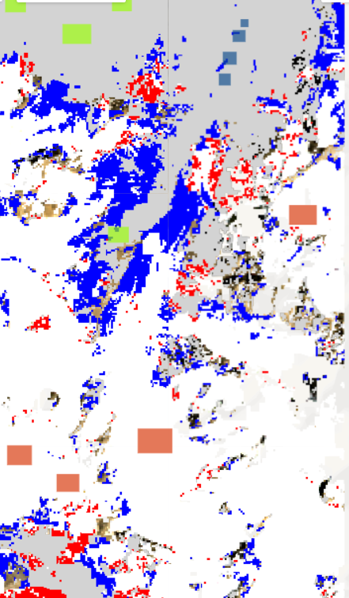

# Himalayan Eye

## AI-Based Snow/Ice Classification and Change Detection Using Multi-Temporal Satellite Imagery

Himalayan Eye is a remote-sensing machine-learning project that uses multi-temporal satellite imagery to classify **Snow/Ice, Rock/Bare Land, and Water** and examine how their mapped spatial distribution changes between **2015, 2020, and 2025**.

The project combines **Landsat imagery, Sentinel-2 imagery, spectral indices, Random Forest classification, spatial validation, feature-importance analysis, and temporal transition analysis**.

> **Important:** The detected changes represent changes in classified surface area. They should not be interpreted directly as glacier mass balance or as evidence of a specific climatic cause.

---

## 1. Overview

The objective of Himalayan Eye is to build a reproducible machine-learning workflow for monitoring snow/ice-covered surfaces from satellite imagery.

The workflow includes:

* Multi-temporal satellite data preparation
* Spectral-index generation
* Supervised land-cover classification
* Random Forest modelling
* Random and spatial validation
* NDSI ablation analysis
* Multi-year area comparison
* Pixel-level transition analysis
* Cross-sensor comparison between Landsat and Sentinel-2

---

## 2. Research Question

**How effectively can machine learning classify Snow/Ice, Rock/Bare Land, and Water from multi-temporal satellite imagery, and what spatial changes in the classified Snow/Ice extent can be observed between 2015 and 2025?**

---

## 3. Objectives

1. Classify the study region into three surface classes:

   * Snow/Ice
   * Rock/Bare Land
   * Water

2. Evaluate classification performance using both random holdout and spatial validation.

3. Investigate the contribution of spectral indices, particularly the **Normalized Difference Snow Index (NDSI)**.

4. Compare classified Snow/Ice area across 2015, 2020, and 2025.

5. Analyse pixel-level Snow/Ice gains and losses between 2015 and 2025.

6. Compare Landsat and Sentinel-2 classifications as a cross-sensor consistency check.

---

## 4. Study Area

The analysis covers a study region of approximately:

**56.48 km²**

The same study region was used for the multi-temporal classification workflow.

Because satellite observations can be affected by acquisition date, cloud conditions, illumination, and sensor characteristics, the results represent the conditions captured in the selected imagery rather than continuous year-round snow/ice coverage.

---

## 5. Satellite Data

### Landsat

The primary multi-temporal classification uses Landsat imagery for:

* **2015**
* **2020**
* **2025**

The 2025 analysis incorporates Landsat 8 and Landsat 9 imagery.

### Sentinel-2

Sentinel-2 imagery was additionally used for a cross-sensor comparison.

The Sentinel-2 collection used in the analysis contained:

* **11 images**
* **26 bands**

---

## 6. Methodology

The overall workflow was:

```text
Satellite Imagery
       ↓
Preprocessing / Image Selection
       ↓
Spectral Bands
       ↓
NDSI + NDVI + NDWI
       ↓
Training Samples
       ↓
Random Forest Classification
       ↓
Random Holdout Validation
       ↓
Spatial Checkerboard Validation
       ↓
NDSI Ablation
       ↓
2015 / 2020 / 2025 Classification
       ↓
Temporal Change Analysis
       ↓
Landsat–Sentinel-2 Comparison
```

The classification used spectral bands together with:

* **NDSI** — Normalized Difference Snow Index
* **NDVI** — Normalized Difference Vegetation Index
* **NDWI** — Normalized Difference Water Index

---

## 7. Machine Learning Model

A **Random Forest classifier** was used for supervised classification.

The model distinguishes three classes:

| Class | Description    |
| ----- | -------------- |
| 0     | Snow/Ice       |
| 1     | Rock/Bare Land |
| 2     | Water          |

A total of **1,563 labelled samples** were used.

The random holdout split contained:

* **1,264 training samples**
* **299 validation samples**

---

## 8. Validation

Two validation strategies were used.

### Random Holdout Validation

The random validation produced:

* **Accuracy:** 98.997%
* **Kappa:** 0.9821

Confusion matrix:

```text
[[167,   0,   0],
 [  0, 101,   3],
 [  0,   0,  28]]
```

### Spatial Checkerboard Validation

To provide a more spatially independent evaluation, the samples were divided using a stratified spatial checkerboard approach.

* Spatial training samples: **775**
* Spatial validation samples: **788**
* Spatial accuracy: **96.827%**
* Spatial Kappa: **0.9469**

Spatial validation is treated as the more conservative performance measure because nearby pixels can otherwise make random train/test splits appear easier than a spatially separated evaluation.

### Spatial Class Performance

| Class          | Precision | Recall |    F1 |
| -------------- | --------: | -----: | ----: |
| Snow/Ice       |     1.000 |  1.000 | 1.000 |
| Rock/Bare Land |     0.985 |  0.924 | 0.954 |
| Water          |     0.826 |  0.962 | 0.889 |

---

## 9. NDSI Ablation

An ablation experiment was performed to examine the contribution of NDSI.

### With NDSI

**Spatial accuracy: 96.827%**

### Without NDSI

**Spatial accuracy: 96.066%**

### Difference

**+0.761 percentage points**

The spatial Kappa also decreased from:

**0.9469 → 0.9342**

when NDSI was removed.

The result indicates that NDSI provided useful information for the classification task in this study.

### Relative Feature Importance

The calculated relative importance values were:

| Feature | Relative Importance |
| ------- | ------------------: |
| NDSI    |               48.52 |
| NDWI    |               26.44 |
| NDVI    |               23.36 |

These values are reported as relative importance indices and should not be interpreted as percentages.

---

## 10. Temporal Change Analysis

The classified Snow/Ice areas were:

| Year | Snow/Ice Area |
| ---- | ------------: |
| 2015 |    30.063 km² |
| 2020 |    27.792 km² |
| 2025 |    32.631 km² |

The simple difference between the 2015 and 2025 mapped Snow/Ice areas was:

**+2.568 km²**

However, a direct area difference and a pixel-level transition analysis answer different questions.

### Common-Valid Transition Analysis

The common valid comparison area was:

**47.560 km²**

Within this common area:

* Stable Snow/Ice: **25.721 km²**
* Snow/Ice loss: **1.527 km²**
* Snow/Ice gain: **5.501 km²**
* Net Snow/Ice transition change: **+3.974 km²**

The transition analysis therefore captures changes occurring on pixels that were valid for the 2015–2025 comparison, while the yearly mapped-area calculation uses the full valid area for each individual classification.

---

## 11. Cross-Sensor Validation

A Landsat–Sentinel-2 comparison was performed as a **cross-sensor consistency check**.

Comparison area:

**49.732 km²**

Agreement:

**42.118 km²**

Disagreement:

**7.614 km²**

Overall agreement:

**84.691%**

This result provides an additional indication of how consistently the classification behaves across the two sensor types.

It should **not** be interpreted as ground-truth accuracy because neither sensor classification was treated as an independent reference dataset.

---

## 12. Key Results

### Classification

* Random holdout accuracy: **98.997%**
* Spatial validation accuracy: **96.827%**
* Spatial Kappa: **0.9469**

### Snow/Ice Area

* 2015: **30.063 km²**
* 2020: **27.792 km²**
* 2025: **32.631 km²**

### NDSI Ablation

* With NDSI: **96.827%**
* Without NDSI: **96.066%**
* Improvement: **0.761 percentage points**

### Cross-Sensor Comparison

* Landsat–Sentinel-2 agreement: **84.691%**

### Final Change Map

The final change map distinguishes:

* Stable Snow/Ice
* Snow/Ice loss
* Snow/Ice gain
* Other/no-snow areas



---

## 13. Limitations

Several limitations should be considered when interpreting the results:

1. **Seasonality:** Snow and ice extent can vary substantially depending on acquisition date and seasonal conditions.

2. **Cloud and atmospheric effects:** Satellite observations may contain residual effects despite preprocessing and image selection.

3. **Sensor differences:** Landsat and Sentinel-2 have different spatial, spectral, and temporal characteristics.

4. **Classification uncertainty:** Misclassification can occur, particularly where Rock/Bare Land, Water, and Snow/Ice have similar spectral characteristics.

5. **Common comparison area:** The 2015–2025 transition analysis uses a common valid area of approximately **47.56 km²**, smaller than the total study region.

6. **No causal attribution:** The observed spatial changes are not sufficient to establish that a particular climatic or environmental factor caused the changes.

7. **No mass-balance measurement:** Snow/Ice area classification does not directly measure glacier thickness, volume, or mass balance.

---

## 14. Future Work

Potential extensions include:

* Testing additional machine-learning models such as SVM or gradient boosting.
* Exploring temporal compositing to reduce seasonal variability.
* Incorporating higher-resolution imagery where appropriate.
* Adding independent reference or field-validated samples.
* Testing uncertainty estimation and confidence maps.
* Extending the analysis to additional years.
* Investigating relationships between observed surface changes and environmental variables.
* Developing an optional interactive visualization/dashboard for the final results.

---

## 15. Reproducibility

The repository contains the main analysis script, requirements file, exported results, statistics, and final visualization.

### Repository Structure

```text
Himalayan-Eye/
│
├── Himalayan_eye.js
├── README.md
├── requirements.txt
├── .gitignore
│
└── results/
    ├── figures/
    │   └── final_snow_ice_change_map.png
    │
    ├── maps/
    │   ├── himalayan_eye_classification_2015.tif
    │   ├── himalayan_eye_classification_2020.tif
    │   ├── himalayan_eye_classification_2025.tif
    │   └── himalayan_eye_snow_ice_change_2015_2025.tif
    │
    └── statistics/
        └── final_results.csv
```

The Earth Engine workflow is contained in:

`Himalayan_eye.js`

The final numerical results are available in:

`results/statistics/final_results.csv`

The exported classification and change maps are available in:

`results/maps/`

---

## Project Status

**Core analysis: Complete**

The current version focuses on the reproducible satellite-image classification and change-detection workflow. An interactive dashboard is not required for the core project and may be developed as a future extension.
